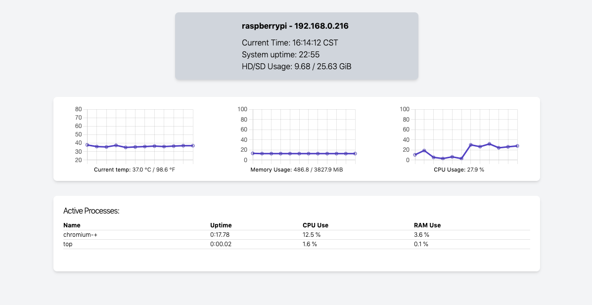

# PiStatsLive

**PiStatsLive** is a monitoring server for Raspberry Pi devices built with   
Phoenix LiveView.

## Features

  * Displays temperature, CPU/memory/disk usage, and system uptime
  * Charts show previous 30 seconds of activity
  * Process monitor shows non-idle non-system processes

## System Requirements

PiStatsLive was designed and tested on a Raspberry Pi 4B running Raspbian 10.   
It will likely work on other models, as long as the OS is Raspbian.

## Installation

To start the server:

  * [Ensure that your system has Phoenix and its dependencies installed](https://hexdocs.pm/phoenix/installation.html) (Note: A database is NOT required to run this server)
  * Install app dependencies with `mix deps.get`
  * Install Node.js dependencies with `npm install` inside the `assets` directory
  * Start Phoenix endpoint with `mix phx.server`

Now you can visit http://[raspberry pi local IP]:4000/stats from any device on the local network.
